<p align="center">
  
</p>

<div align="center">
  <a href="https://www.linkedin.com/in/hamza-ghazi-9a5a38330/">
    
  </a>
  <a href="https://www.boot.dev/u/mhg2001">
    
  </a>
  <a href="mailto:hamzahghazi2001@gmail.com">
    
  </a>
</div>

## SYSTEM_PROFILE

Python backend development, relational data, automated testing, Linux tooling, and application security.

## TOOLCHAIN

<p>
  
  
  
  
  
  
  
  
  
</p>

**Focus areas:** OOP · data structures and algorithms · relational modelling · authentication flows · threat modelling · debugging · backend test design

## FEATURED_BUILDS

### 🔐 [hybridAUTH](https://github.com/hamzahghazi2001/hybridAUTH-demo)

Passkey-first authentication prototype focused on **WebAuthn ceremonies, hardened account recovery, recent reauthentication, lockout logic, audit logging, and scripted security testing**.

**Signals**
- FIDO2 / WebAuthn registration and authentication
- Single-use recovery flows with expiring secrets and backup codes
- Forced passkey re-enrolment after recovery
- Sensitive-route recent-auth gates
- `pytest`-driven security checks mapped to STRIDE

<p>
  
  
  
</p>

### 🧭 [BuildSense AI](https://github.com/MCBuildSense-AI/buildsense-mod)

Collaborative **Minecraft Fabric** project built around terrain-aware planning, shared code review, and automated build validation inside a team repository.

<p>
  <a href="https://github.com/MCBuildSense-AI/buildsense-mod/actions/workflows/build.yml">
    
  </a>
  
</p>

## ACTIVE_DEPTH

```text
DSA patterns        -> implementation fluency, complexity analysis, recall under pressure
PostgreSQL          -> schema design, joins, transactions, indexing, query planning
HTTP / APIs         -> integration boundaries, errors, auth, idempotency, debugging
Backend testing     -> pytest workflows, negative paths, database-backed checks
Delivery pipeline   -> Docker, CI/CD, deployment workflow as the stack matures
```

## VERIFIED_TRAINING

<details>
<summary><strong>Boot.dev completion certificates</strong></summary>

<br>

<p>
  <a href="https://www.boot.dev/certificates/7ef576c4-c518-4753-9854-a32b4398ab11">
    
  </a>
  <a href="https://www.boot.dev/certificates/5332ec28-ed40-4ba0-8201-4ec5677f37a6">
    
  </a>
  <a href="https://www.boot.dev/certificates/a9668dee-4df5-4200-8134-b06ab31fa871">
    
  </a>
  <a href="https://www.boot.dev/certificates/78faa869-cca8-462b-9e37-e310e6083859">
    
  </a>
  <a href="https://www.boot.dev/certificates/6e1aa846-9fa4-4a02-863c-7a07be5b636f">
    
  </a>
</p>

</details>

## GITHUB_ACTIVITY

<p align="center">
  
</p>

<sub>Generated inside this repository from GitHub's GraphQL API. No third-party stats renderer.</sub>
